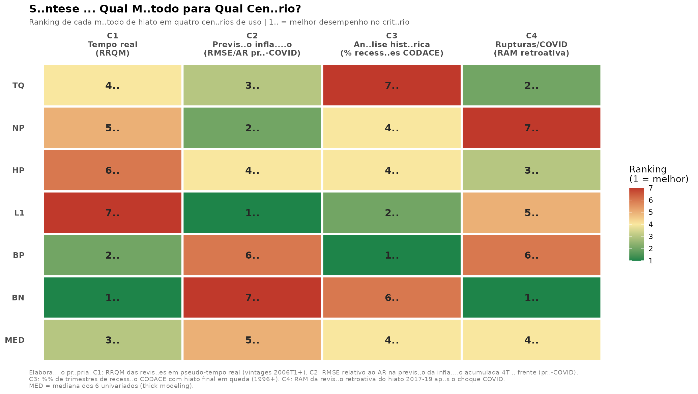

# Hiato do Produto no Brasil: Qual Método para Qual Cenário?

Replicação independente e avaliação comparativa dos **12 métodos de estimação do hiato do produto** do Banco Central do Brasil (Relatório de Inflação, Junho/2024, "Métodos de estimação do hiato do produto"), com avaliação empírica de eficiência **condicional ao cenário de uso**.

Trabalho de Conclusão de Curso — Economia, FGV EESP.

> **Reprodutibilidade total:** todos os dados são baixados automaticamente por código (APIs do BCB/SGS, FTP do IBGE e Ipeadata). Nenhum arquivo manual é necessário. `Rscript hiato_completo.R` reproduz cada número e figura do trabalho em ~2–3 minutos.

---

## Resultados em uma figura



**Nenhum método domina: quatro cenários de uso, três vencedores diferentes.**

| Hiato | C1 Tempo real (RRQM) | C2 Previsão de inflação (RMSE/AR) | C3 Histórica (% recessões CODACE) | C4 Rupturas/COVID (RAM) |
|---|---|---|---|---|
| Tend. Quadrática | 4º | 3º | 7º | **2º** |
| LOESS | 5º | 2º | 4º | 7º |
| Hodrick-Prescott | 6º | 4º | 4º | 3º |
| Tendência ℓ₁ | 7º | **1º** | 2º | 5º |
| Band-Pass (CF) | 2º | 6º | **1º** | 6º |
| Beveridge-Nelson (KMW) | **1º** | 7º | 6º | **1º** |
| Mediana (thick modeling) | 3º | 5º | 4º | 4º |

Destaques: o **espelho BN × ℓ₁** (especialistas opostos: confiabilidade em tempo real vs. conteúdo informacional); o **HP nunca acima do 3º lugar** em critério algum; a **mediana nunca vence e nunca perde** — thick modeling como estratégia de robustez de mensuração, não de previsão.

---

## Conteúdo

```
.
├── hiato_completo.R            # Script principal: 12 métodos + 4 cenários + 11 figuras
├── verif_areosa.R              # Verificação numérica da Proposição 1 (sistema exato vs. fórmula)
├── secao_proposicao_areosa.md  # Proposição 1: solução fechada do método de Areosa (2008)
├── g1_*.png ... g11_*.png      # Figuras da rodada de referência
├── console_output.txt          # Console completo da rodada de referência
├── sessionInfo.txt             # Versões de R e pacotes
└── README.md
```

### Os 12 métodos (BCB RI Jun/2024)

**Univariados (1996T1+):** I. Tendência quadrática com quebras (Bai-Perron) · II. Tendência não-paramétrica (LOESS) · III. Hodrick-Prescott (λ=1600) · IV. Tendência ℓ₁ (Kim et al., 2009; ADMM) · V. HP modificada (Andrle, 2013; Kalman/KFAS) · VI. Band-Pass Christiano-Fitzgerald assimétrico (8–32T) · VII. Beveridge-Nelson modificado (Kamber, Morley & Wong, 2018; correção de pandemia de Morley et al., 2023)

**Multivariados:** MII.I Função de produção — combinação simples (2012T2+) · MII.II Areosa (2008) — pela solução fechada da Proposição 1 · MII.III CBO/Shackleton (2018) — regressões por partes com picos CODACE (2002T2+) · MII.IV Jarocinski & Lenza (2018) — fator dinâmico linearizado · MII.V Componentes principais

### Os 4 cenários de avaliação

1. **Política monetária em tempo real** — vintages recursivos trimestrais 2006T1+; RAM, RRQM, correlação RT×final, troca de sinal (no espírito de Cusinato, Minella & Pôrto Jr., BCB WP 203)
2. **Previsão de inflação** — Curva de Phillips fora-da-amostra (π4 acumulada 4T à frente), janela expansiva, benchmark AR, teste de Diebold-Mariano (Orphanides & van Norden, 2005)
3. **Análise histórica** — captura de recessões CODACE/FGV pela série final
4. **Robustez a rupturas** — revisão retroativa do hiato 2017–2019 após o choque da COVID

### Proposição 1 (contribuição analítica)

O problema de Areosa (2008) — três filtros HP interligados pela restrição Cobb-Douglas — tem **solução analítica fechada** sob λ comum:

**ĥ_Areosa = (1/κ)·ĥ_FP + ((β₁²+β₂²)/κ)·ĥ_HP,  κ = 1+β₁²+β₂²**

Com β₁=0,6 e β₂=0,4: **0,658·FP + 0,342·HP**. Enunciado, demonstração e corolários em [`secao_proposicao_areosa.md`](secao_proposicao_areosa.md); verificação numérica (erro máximo 4,6×10⁻¹¹ ante o sistema exato 2T×2T) em [`verif_areosa.R`](verif_areosa.R).

---

## Replicação

### Requisitos

- R ≥ 4.3 (rodada de referência: 4.3.3; ver `sessionInfo.txt`)
- Pacotes: `tidyverse`, `mFilter`, `KFAS`, `jsonlite`, `readxl`, `scales`
- Acesso à internet (APIs: BCB/SGS, FTP IBGE, Ipeadata)

```r
install.packages(c("tidyverse", "mFilter", "KFAS", "jsonlite", "readxl", "scales"))
```

### Execução

```bash
Rscript hiato_completo.R      # ~2-3 min; gera g1–g11.png no diretório de execução
Rscript verif_areosa.R        # verificação da Proposição 1 (~10 s)
```

O script baixa automaticamente: PIB (SGS 22109), NUCI FGV (28561), desemprego PNADC (24369), Novo Caged (28763), IPCA (433), núcleo de serviços (10844), Focus (13522), a PME nova metodologia (FTP IBGE, tabela 177, para a retropolação do desemprego 2002–2011) e o estoque de capital Ipea/DIMAC (`DIMAC_CF_ELC_TOT12`, Souza Júnior & Cornelio, 2020).

### Avisos

- Os dados das APIs são **vintage-dependentes**: rodadas em datas diferentes podem produzir números ligeiramente distintos dos reportados (revisões do PIB e atualizações das séries). A rodada de referência está congelada em `console_output.txt`.
- O exercício de tempo real é **pseudo-real-time** (série atual, sem revisões de dados): isola o viés de final de amostra, que a literatura aponta como componente dominante das revisões.

---

## Referências principais

BCB (2024). *Métodos de estimação do hiato do produto*. Relatório de Inflação, jun/2024 — boxe e apêndices. · Cusinato, Minella & Pôrto Jr. (2013). *Empirical Economics* (BCB WP 203). · Orphanides & van Norden (2002, *REStat*; 2005, *JMCB*). · Kamber, Morley & Wong (2018, *REStat*). · Areosa (2008, BCB WP 172). · Kim et al. (2009, *SIAM Review*). · Andrle (2013). · Shackleton (2018, CBO). · Jarocinski & Lenza (2018, *JMCB*). · Morley et al. (2023). · Souza Júnior & Cornelio (2020, Ipea).

## Licença e citação

Código sob licença MIT. Se usar este material, cite o TCC (referência completa a ser adicionada após o depósito) e este repositório.
